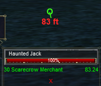

---
tags:
  - plugin
resource_link: "https://www.redguides.com/community/resources/mq2otd.2248/"
support_link: "https://www.redguides.com/community/threads/mq2otd.79140/"
repository: "https://github.com/RedGuides/MQ2OTD"
config: "MQ2OTD.ini"
authors: "Omnictrl, Knightly"
tagline: "Displays a compass to your target, aka *overhead target direction*"
---

# MQ2OTD

<!--desc-start-->
Adds an icon to the HUD indicating where your target is located in relation to you and how far away it is.
<!--desc-end-->



## Commands

<a href="cmd-otd/">

</a>
:     {{ readMore('projects/mq2otd/cmd-otd.md') }}

## FAQ

!!! question "I can't seem to get it to display?"
    Press **F-11** to ensure your "lag meter" is displayed. Ensure you **/otd on**.

!!! question "How to move display position on screen?"
    Use `/otd moveby x y` to move the display incrementally by x,y pixels.

## Settings

Example MQ2OTD.ini, you can set per character or globally.

```ini
[Bobby]
VISIBLE=1
BASE_X=600
BASE_Y=300
RANGE_ON=1
[GLOBAL]
DRAW_TIGHT=0
```
